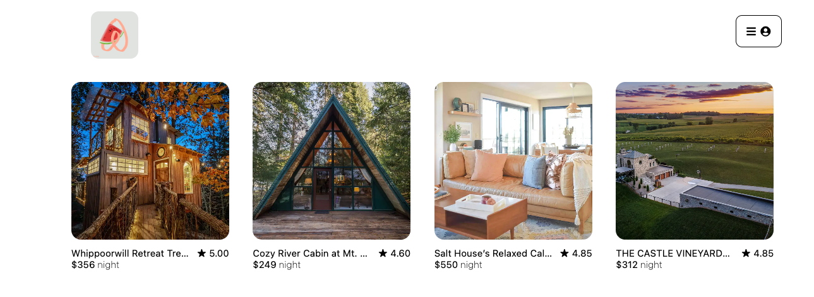

# 🏝️ AirClone

## 🧐 Description
AirClone is a website clone, inspired by Airbnb. AirClone can be used for posting spots for booking, leaving reiviews for booked spots, booking spots for your vacations.

[Live site](https://sarah-booking-spots.onrender.com)

## 👩‍💻 Technologies used
Framewors/Platforms/Libraries:
Javascript, Express, Sequalize, React, Redux, HTML, CSS

Database:
Postgres

Hosting:
Render

## 🚧 To do list for future features
Need to build booking related CRUD feature

## 🌐 Landing Page

## 🏁 Get started
In order to run the repo locally, you will need to
1. cd into root folder and run npm install
2. cd into backend folder and npm start
3. cd into frontend folder and npm start

## 📝 Contact information
lingxi1023@gmail.com
